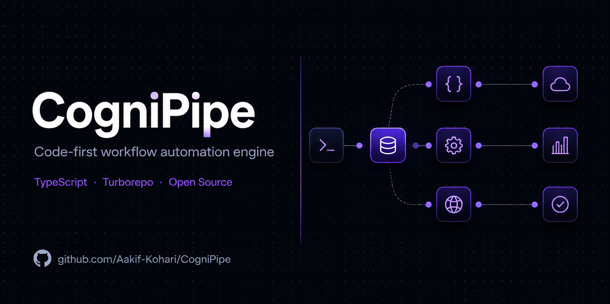
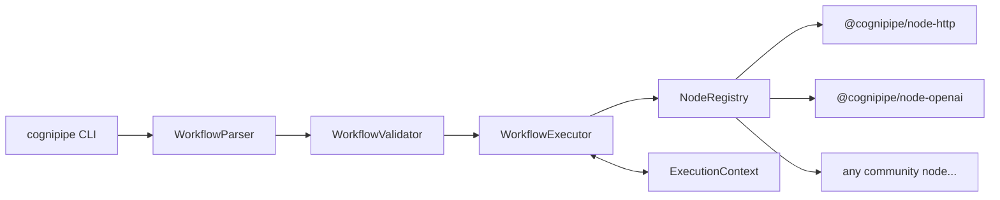

<div align="center">

# CogniPipe



**Code-first workflow automation engine.**
Chain AI models, APIs & transforms into type-safe, testable pipelines.

[](https://github.com/Aakif-Kohari/CogniPipe/actions/workflows/ci.yml)

  <!-- [](...) -->

[](LICENSE)
[](CONTRIBUTING.md)
[](https://codecov.io/gh/Aakif-Kohari/CogniPipe)
[](https://nodejs.org)
[](https://pnpm.io)

</div>

---

## What is CogniPipe?

Most workflow automation tools are GUI-first — you click, drag, and pray the export works.
CogniPipe flips this: **workflows are TypeScript-typed YAML files** that live in your repo,
get reviewed in PRs, tested in CI, and version-controlled like everything else.

The engine runs **nodes** — small, focused packages that each wrap one external service or
operation. Chain them together to build AI pipelines, data transforms, or any automated
workflow your team needs.

```yaml
# workflow.yaml
name: summarize-github-issues
steps:
  - name: fetch-issues
    uses: '@cognipipe/node-github'
    config:
      action: list-issues
      repo: your-org/your-repo
      state: open

  - name: summarize
    uses: '@cognipipe/node-openai'
    config:
      model: gpt-4o
      prompt: 'Summarize these issues into a daily digest: {{ steps.fetch-issues.output.issues }}'

  - name: post-to-slack
    uses: '@cognipipe/node-slack'
    config:
      channel: '#engineering'
      text: '{{ steps.summarize.output.content }}'
```

```bash
cognipipe run workflow.yaml
```

---

## Architecture



The **core engine** handles parsing, validation, execution, and context management.
**Nodes** are independently versioned npm packages — community contributed, individually tested.

---

## Quick Start

### Prerequisites

- Node.js >= 22
- pnpm >= 9

### Install

```bash
npm install -g cognipipe
# or
pnpm add -g cognipipe
```

### Run your first workflow

```bash
# Scaffold a new workflow project
cognipipe init my-pipeline
cd my-pipeline

# Install a node
pnpm add @cognipipe/node-http @cognipipe/node-openai

# Run the example workflow
cognipipe run workflow.yaml
```

---

## Available Nodes

| Node         | Package                     | Description                                        |
| ------------ | --------------------------- | -------------------------------------------------- |
| HTTP Request | `@cognipipe/node-http`      | Generic HTTP calls — GET, POST, PUT, DELETE        |
| OpenAI       | `@cognipipe/node-openai`    | ChatCompletion, Embeddings (gpt-4o, gpt-3.5-turbo) |
| Anthropic    | `@cognipipe/node-anthropic` | Claude API (claude-3-5-sonnet, claude-3-haiku)     |
| Slack        | `@cognipipe/node-slack`     | Send messages, post to channels                    |
| GitHub       | `@cognipipe/node-github`    | Issues, PRs, repos, webhooks                       |
| Transform    | `@cognipipe/node-transform` | JSON, CSV, text operations                         |

> **Want a new node?**
> [Request one](https://github.com/Aakif-Kohari/CogniPipe/issues/new?template=node_request.yml)
> or [build one yourself](CONTRIBUTING.md#building-a-new-node) — community contributions welcome!

---

## Building Your Own Node

Every node is a standalone TypeScript package in the `nodes/` directory.
Copy the `node-template/` folder to get started:

```bash
cp -r node-template nodes/node-myservice
cd nodes/node-myservice
```

Implement the `BaseNode` interface:

```typescript
import { BaseNode, CogniNode } from '@cognipipe/sdk';
import type { IExecutionContext, NodeConfig, NodeOutput } from '@cognipipe/types';

/** Sends data to MyService API */
@CogniNode({ type: '@cognipipe/node-myservice', version: '1.0.0' })
export class MyServiceNode extends BaseNode {
  /**
   * Executes the node — called by the workflow engine for each step.
   * @param config - Validated config from workflow.yaml
   * @param ctx - Execution context containing outputs from previous steps
   * @returns NodeOutput containing results accessible to downstream steps
   */
  async execute(config: NodeConfig, ctx: IExecutionContext): Promise<NodeOutput> {
    // your implementation
    return { result: 'done' };
  }
}
```

See [CONTRIBUTING.md](CONTRIBUTING.md#building-a-new-node) for the full guide,
test requirements, and PR checklist.

---

## Monorepo Structure

```
cognipipe/
├── apps/
│   ├── cli/          # The `cognipipe` command-line tool
│   └── docs/         # Documentation site (Docusaurus)
├── packages/
│   ├── core/         # Workflow engine: parser, validator, executor, context
│   ├── sdk/          # BaseNode class — extend this to build nodes
│   ├── types/        # Shared TypeScript interfaces
│   └── testing/      # Test utilities for node authors
├── nodes/            # Community-contributed node packages ← contribute here
├── node-template/    # Copy this to scaffold a new node
└── examples/         # Runnable workflow.yaml examples
```

---

## Contributing

All skill levels are welcome. The most common contribution is a **new node package.**

1. Browse [open issues](https://github.com/Aakif-Kohari/CogniPipe/issues?q=is%3Aissue+is%3Aopen+no%3Aassignee)
2. Comment `.take` on any issue — the bot assigns you instantly
3. You have **48 hours** to open a Draft PR (request an extension anytime)
4. Read [CONTRIBUTING.md](CONTRIBUTING.md) for setup, conventions, and the PR checklist

---

## Community

|                |                                                                                                                  |
| -------------- | ---------------------------------------------------------------------------------------------------------------- |
| 💬 Questions   | [GitHub Discussions → Help Wanted](https://github.com/Aakif-Kohari/CogniPipe/discussions/categories/help-wanted) |
| 💡 Ideas       | [GitHub Discussions → Ideas](https://github.com/Aakif-Kohari/CogniPipe/discussions/categories/ideas)             |
| 🎉 Show & Tell | [GitHub Discussions → Show & Tell](https://github.com/Aakif-Kohari/CogniPipe/discussions/categories/show-tell)   |
| 🐛 Bug Report  | [Open an issue](https://github.com/Aakif-Kohari/CogniPipe/issues/new?template=bug_report.yml)                    |
| 📋 Roadmap     | [ROADMAP.md](ROADMAP.md)                                                                                         |

---

## License

MIT © [Aakif Kohari](https://github.com/Aakif-Kohari)
