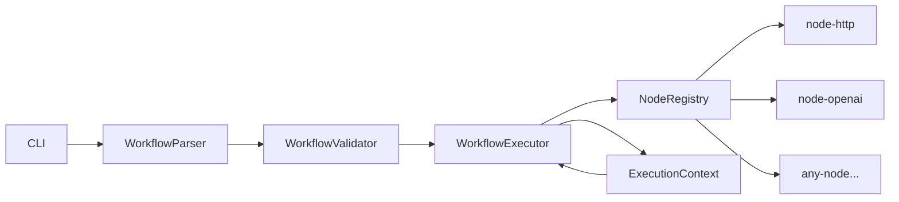

<!-- Header badges - get URLs after repo is live -->
<div align="center">
  <!--  -->

  <h1>CogniPipe</h1>
  <p><strong>Code-first workflow automation engine.</strong><br>
  Chain AI models, APIs & transforms into type-safe, testable pipelines.</p>

[](https://github.com/Aakif-Kohari/CogniPipe/actions/workflows/ci.yml)

  <!-- [](...) -->

[](LICENSE)
[](CONTRIBUTING.md)
[](https://codecov.io/gh/Aakif-Kohari/CogniPipe)
[](https://nodejs.org)
[](https://pnpm.io)

</div>

---

<!-- ## Why CogniPipe? -->

<!-- 3–4 sentences: the pain → the solution → the differentiator -->

<!-- ## Demo -->

<!-- GIF or screenshot of a workflow running in the terminal -->

## Quick Start

### Prerequisites

- Node.js >= 18
- pnpm >= 9

### Install

```bash
npm install -g cognipipe
# or
pnpm add -g cognipipe
```

### Your First Workflow

```yaml
# workflow.yaml
name: my-first-pipeline
steps:
  - name: fetch-data
    uses: '@cognipipe/node-http'
    config:
      method: GET
      url: https://api.github.com/repos/USERNAME/cognipipe

  - name: summarize
    uses: '@cognipipe/node-openai'
    config:
      model: gpt-4o
      prompt: 'Summarize this repo data: {{ steps.fetch-data.output.body }}'
```

```bash
cognipipe run workflow.yaml
```

## Architecture

<!-- Mermaid diagram of the core pipeline -->



## Available Nodes

| Node         | Package                     | Description                |
| ------------ | --------------------------- | -------------------------- |
| HTTP Request | `@cognipipe/node-http`      | Generic HTTP calls         |
| OpenAI       | `@cognipipe/node-openai`    | ChatCompletion, Embeddings |
| Anthropic    | `@cognipipe/node-anthropic` | Claude API                 |
| Slack        | `@cognipipe/node-slack`     | Send messages              |
| GitHub       | `@cognipipe/node-github`    | Issues, PRs, repos         |
| Transform    | `@cognipipe/node-transform` | JSON, CSV, text ops        |

> **Want a new node?** [Request one](../../issues/new?template=node_request.yml) or [build one](CONTRIBUTING.md#building-a-node).

## Building Your Own Node

```typescript
import { BaseNode, NodeConfig, NodeOutput } from '@cognipipe/sdk';

@CogniNode({ type: 'my-org/my-node', version: '1.0.0' })
export class MyNode extends BaseNode {
  async execute(config: NodeConfig, ctx: ExecutionContext): Promise<NodeOutput> {
    // your logic here
    return { result: 'done' };
  }
}
```

<!-- ## Monorepo Structure -->
<!-- Brief explanation of apps/, packages/, nodes/ -->

## Contributing

See [CONTRIBUTING.md](CONTRIBUTING.md). All skill levels welcome.

## Community

- 💬 [GitHub Discussions](../../discussions)
- 🐛 [Report a Bug](../../issues/new?template=bug_report.yml)
- 💡 [Request a Feature](../../issues/new?template=feature_request.yml)

## License

MIT © Aakif Kohari
